# Linux iptables Firewall Hardening Lab

## Overview

This project demonstrates the configuration and validation of a host-based firewall using **iptables** on Rocky Linux. The objective was to implement a **default-deny security model**, allowing only required services while restricting unauthorized access.

The lab was performed using a small virtualized environment consisting of a Linux server hosting an Apache web service and a client workstation used for validation and testing.

---

## Objectives

- Disable `firewalld` and manage firewall rules directly with `iptables`
- Configure a default-deny firewall policy
- Allow only authorized traffic for:
  - SSH (TCP/22)
  - HTTP (TCP/80)
  - ICMP (Ping)
  - FTP (TCP/21)
- Explicitly reject Telnet (TCP/23)
- Validate network connectivity before and after hardening
- Save firewall rules for persistence across reboots
- Document testing and troubleshooting procedures

---

## Lab Environment

| Host | IP Address | Role |
|--------|-----------|--------|
| server1 | 10.0.3.11 | Rocky Linux Web Server / Firewall |
| guiserver | 10.0.3.10 | Client Workstation |

---

## Technologies Used

- Rocky Linux
- iptables
- iptables-services
- Apache HTTP Server (httpd)
- Ncat
- Telnet
- Linux CLI

---

## Initial Firewall State

The system initially contained existing firewall rules and permissive policies. The rules were reviewed and documented before any modifications were made.

### Existing Firewall Configuration

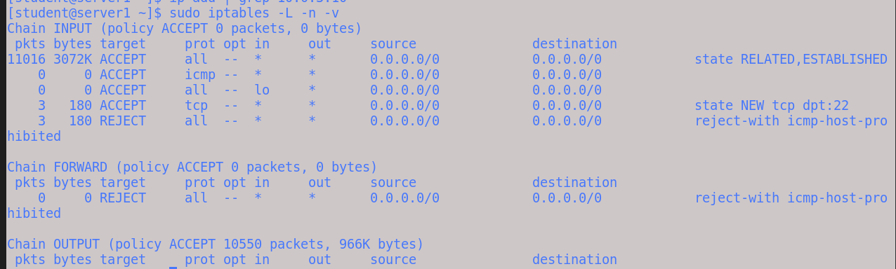

---

## Preparing the Firewall Environment

### Disable firewalld and Enable iptables

The native Rocky Linux firewall service (`firewalld`) was disabled and replaced with the traditional `iptables` service.

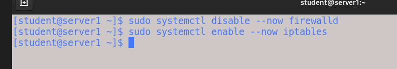

### Verify iptables Service

The iptables service was verified to be active and enabled.

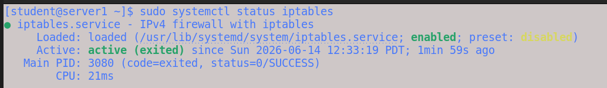

---

## Server Validation

The server network configuration was verified prior to implementing firewall changes.

### Network Configuration

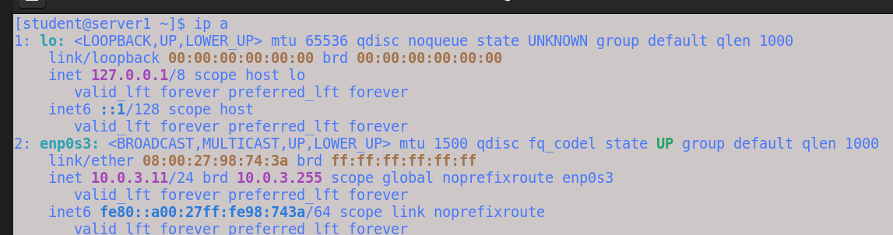

### Apache Web Server Validation

Apache was installed and validated locally.

```bash
curl localhost
```

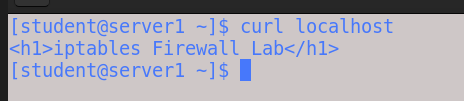

### Remote HTTP Validation

Connectivity from the client workstation was verified.

```bash
curl http://10.0.3.11
```

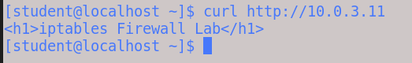

---

## Firewall Reset

Existing rules were removed and the firewall was reset to a known baseline configuration.

### Reset Firewall Policies

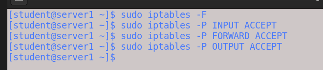

### Clean Firewall State

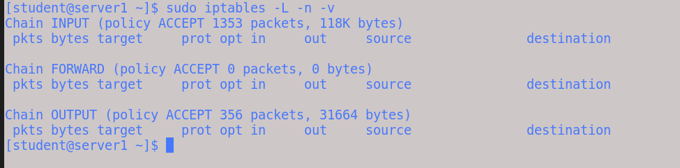

---

## Firewall Rule Configuration

### Rule 1 – Allow Loopback Traffic

```bash
iptables -A INPUT -i lo -j ACCEPT
```

Allows local services to communicate through the loopback interface.


---

### Rule 2 – Allow Established and Related Connections

```bash
iptables -A INPUT -m conntrack --ctstate ESTABLISHED,RELATED -j ACCEPT
```

Allows return traffic for existing sessions.


---

### Rule 3 – Allow SSH and HTTP

```bash
iptables -A INPUT -p tcp -s 10.0.3.0/24 --dport 22 -j ACCEPT
iptables -A INPUT -p tcp -s 10.0.3.0/24 --dport 80 -j ACCEPT
```

Allows administrative access and web traffic from the lab network.

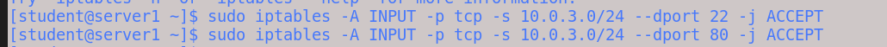

### Firewall Validation

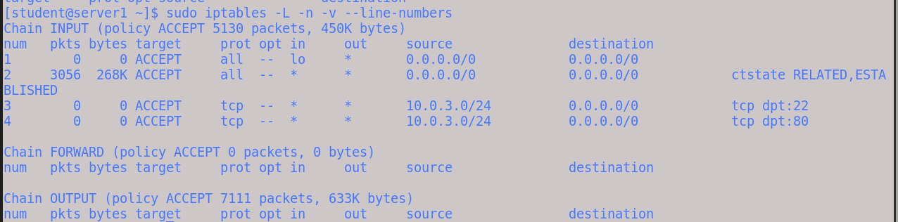

---

### Rule 4 – Allow ICMP

```bash
iptables -A INPUT -p icmp -s 10.0.3.0/24 -j ACCEPT
```

Allows network troubleshooting using ping.

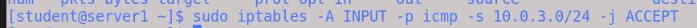

---

## Default Deny Policy

After required access rules were configured, the firewall was hardened using a default-deny approach.

```bash
iptables -P INPUT DROP
```

Any traffic not explicitly allowed is dropped.

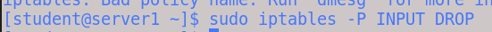

---

## Explicit Deny Rule

An explicit Telnet deny rule was added.

```bash
iptables -A INPUT -p tcp --dport 23 -j REJECT
```

Telnet is an insecure protocol and should not be used for remote administration.

### Telnet Reject Rule


### Telnet Access Denied

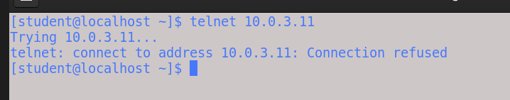

---

## FTP Access Control Demonstration

To demonstrate how firewall exceptions can be created within a default-deny firewall model, an FTP allow rule was added for the lab subnet.

```bash
iptables -A INPUT -p tcp -s 10.0.3.0/24 --dport 21 -j ACCEPT
```

### FTP Rule Added

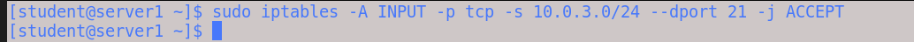

### FTP Access Validation

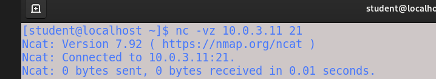

---

## Final Firewall Configuration

The final firewall policy includes:

- Loopback Access
- Established / Related Connections
- SSH (TCP/22)
- HTTP (TCP/80)
- ICMP
- FTP (TCP/21)
- Telnet Explicitly Rejected
- Default INPUT Policy = DROP

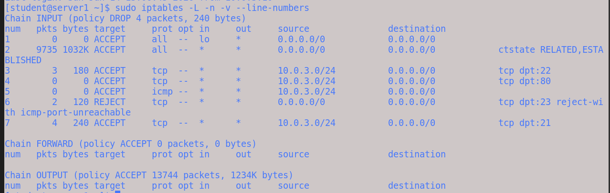

---

## Persistence

Firewall rules were saved to ensure they survive service restarts and system reboots.

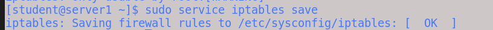

---

## Key Concepts Demonstrated

- Host-based firewall administration
- Linux service management
- Default-deny security models
- Stateful packet filtering
- Connection tracking (`conntrack`)
- Network troubleshooting
- Service validation and testing
- Security hardening practices

---

## Lessons Learned

This lab reinforced the importance of validating services before implementing security controls. A successful firewall deployment requires understanding the relationship between:

1. Network connectivity
2. Firewall policy
3. Service availability

The project also demonstrated how rule ordering, default policies, and explicit allow/deny rules affect traffic flow through a Linux host firewall.
